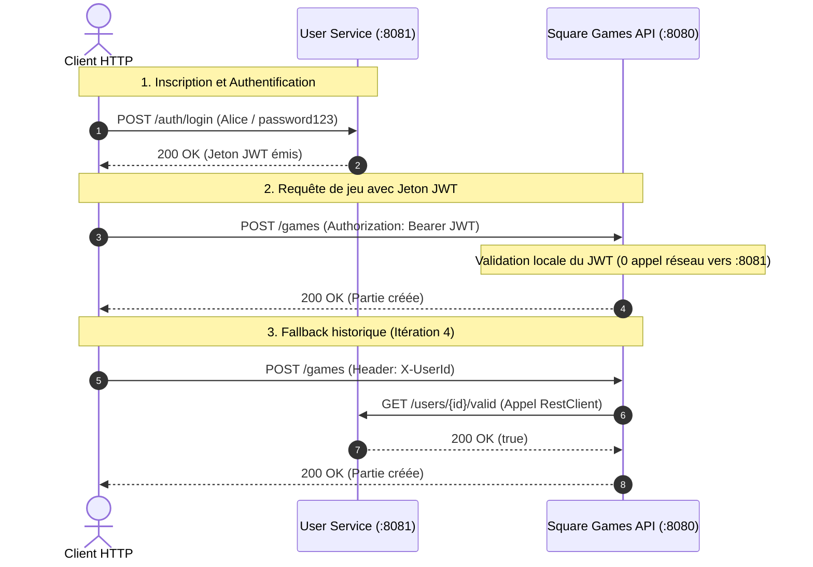

# 👤 JavaSpringUsers — Microservice d'Authentification & Gestion des Utilisateurs

> Microservice autonome de gestion des identités, d'authentification et d'autorisation développé avec **Spring Boot 3.3.4**, **Java 21**, **Spring Security 6**, **JJWT**, **Spring Data JPA** et base de données **H2 in-memory**.  
> Ce microservice collabore directement avec l'API de jeux [Square Games](https://github.com/BSourichanh/JavaSpring.git) (port `8080`).

---

## 📌 Sommaire

1. [Pourquoi ce Microservice ? (Raison d'être)](#-pourquoi-ce-microservice--raison-dêtre)
2. [Architecture & Fonctionnement Inter-services](#-architecture--fonctionnement-inter-services)
3. [La Sécurité sous le Capot (BCrypt, JWT & RBAC)](#-la-sécurité-sous-le-capot-bcrypt-jwt--rbac)
4. [Documentation Détaillée des Endpoints REST](#-documentation-détaillée-des-endpoints-rest)
5. [Base de Données & Console H2](#-base-de-données--console-h2)
6. [Démarrage & Tests Automatisés](#-démarrage--tests-automatisés)

---

## 🎯 Pourquoi ce Microservice ? (Raison d'être)

Dans une architecture logicielle moderne, on évite le modèle "Monolithe" où l'application de jeu gère elle-même les mots de passe et les comptes joueurs dans la même base :
- **Séparation des Responsabilités (*Separation of Concerns*)** : Le métier de ce service est **uniquement** l'identité (inscriptions, logins, validation de droits). Le moteur de jeux n'a pas à connaître les mots de passe ni les adresses email.
- **Sécurité Renforcée** : Les données sensibles des utilisateurs (mots de passe hashés) sont isolées dans leur propre base de données.
- **Évolutivité** : Ce microservice peut servir de fournisseur d'identité (**IdP - Identity Provider**) pour plusieurs applications distinctes (jeux de plateau, boutique en ligne, forum).

---

## 🏛️ Architecture & Fonctionnement Inter-services

Le microservice écoute sur le port **`8081`** et interagit avec le client HTTP et l'API Square Games (`8080`) selon deux mécanismes complémentaires :



---

## 🔐 La Sécurité sous le Capot (BCrypt, JWT & RBAC)

### 1. Hachage des Mots de Passe avec BCrypt (`BCryptPasswordEncoder`)
- **Problème résolu** : Si un attaquant vole la base de données, il ne doit jamais pouvoir lire les mots de passe en clair.
- **Principe de BCrypt** : C'est une fonction à sens unique mathématiquement irréversible. Elle incorpore un **sel aléatoire (*salt*)** unique par utilisateur et applique des milliers de tours de hachage.
- **Résultat en base** : Même si deux utilisateurs ont le même mot de passe `"password123"`, leurs hashs stockés seront totalement différents (ex: `$2a$10$e8TYy...`).

### 2. Jetons JWT Signés en HMAC-SHA256 (`JwtService`)
Lorsqu'un utilisateur valide ses identifiants sur `POST /auth/login`, le service génère un **JSON Web Token** composé de trois segments encodés en Base64Url séparés par des points :
1. **Header** : Spécifie l'algorithme cryptographique (`{"alg": "HS256", "typ": "JWT"}`).
2. **Payload** : Contient les informations certifiées (*claims*) :
   - `sub` : Le nom d'utilisateur (`username`).
   - `userId` : L'identifiant unique UUID.
   - `role` : Le rôle de l'utilisateur (`ROLE_USER` ou `ROLE_ADMIN`).
   - `exp` : La date d'expiration (configurée à 24 heures).
3. **Signature** : Calculée avec la clé secrète partagée (`jwt.secret`). Si une seule virgule du payload est modifiée par le client, la signature mathématique est rompue et le token est rejeté.

### 3. Contrôle d'Accès par Rôles (RBAC) & `@PreAuthorize`
L'annotation `@EnableMethodSecurity` active la sécurisation déclarative des routes dans `UserController` :
- **`@PreAuthorize("hasRole('ADMIN')")`** : Seuls les utilisateurs avec le rôle `ROLE_ADMIN` peuvent appeler `GET /users` (lister tout le monde) ou `DELETE /users/{id}` (supprimer un compte).
- **`@PreAuthorize("hasRole('ADMIN') or @userSecurity.isOwner(authentication, #id)")`** : Pour consulter un profil (`GET /users/{id}`), l'utilisateur doit être soit un Administrateur, soit le propriétaire du compte (vérification dynamique assurée par le composant `UserSecurity`).

### 4. Filtre d'Authentification Stateless (`JwtAuthenticationFilter`)
- Hérite de `OncePerRequestFilter` pour s'exécuter une seule fois par requête entrante.
- Extrait le header `Authorization: Bearer <token>`.
- Vérifie la validité et la signature du jeton via `jwtService.isTokenValid(token)`.
- En cas de succès, injecte un objet `UsernamePasswordAuthenticationToken` avec ses autorités dans le `SecurityContextHolder`.
- L'application est configurée en mode **`SessionCreationPolicy.STATELESS`** : aucune session HTTP ni cookie côté serveur, garantissant une scalabilité maximale.

---

## 🌐 Documentation Détaillée des Endpoints REST

### 1. Inscription d'un Nouvel Utilisateur
- **Route** : `POST /users`
- **Accès** : Public (ouvert à tous)
- **Corps de requête (`UserCreationDto`)** :
  ```json
  {
    "username": "Alice",
    "email": "alice@example.com",
    "password": "password123",
    "role": "ROLE_USER"
  }
  ```
  *(Si `role` est omis, il vaut automatiquement `ROLE_USER`).*
- **Réponse (`201 Created`)** :
  ```json
  {
    "id": "217f5277-bdeb-4e81-85b9-28da19a69230",
    "username": "Alice",
    "email": "alice@example.com",
    "role": "ROLE_USER"
  }
  ```

---

### 2. Connexion & Obtention du Token JWT
- **Route** : `POST /auth/login`
- **Accès** : Public
- **Corps de requête (`LoginRequest`)** :
  ```json
  {
    "username": "Alice",
    "password": "password123"
  }
  ```
- **Réponse (`200 OK`)** :
  ```json
  {
    "token": "eyJhbGciOiJIUzI1NiJ9.eyJzdWIiOiJBbGljZSIsInVzZXJJZCI6IjIxN2Y1Mjc3Li4uIn0.xxxx",
    "userId": "217f5277-bdeb-4e81-85b9-28da19a69230",
    "username": "Alice",
    "role": "ROLE_USER"
  }
  ```
- **Codes d'erreur** :
  - `401 Unauthorized` : Nom d'utilisateur inexistant ou mot de passe invalide.

---

### 3. Consultation d'un Profil par ID
- **Route** : `GET /users/{id}`
- **Headers** : `Authorization: Bearer <token>`
- **Accès** : Réservé à l'administrateur (`ROLE_ADMIN`) ou au propriétaire du compte (`isOwner`).
- **Codes de retour** :
  - `200 OK` : Profil trouvé.
  - `401 Unauthorized` : Token manquant ou expiré.
  - `403 Forbidden` : Tentative de consultation du profil d'un autre utilisateur sans être admin.
  - `404 Not Found` : Utilisateur introuvable.

---

### 4. Liste de Tous les Utilisateurs
- **Route** : `GET /users`
- **Headers** : `Authorization: Bearer <token>`
- **Accès** : Strictement réservé à `ROLE_ADMIN`.
- **Codes de retour** :
  - `200 OK` : Liste des utilisateurs.
  - `403 Forbidden` : Rejet si l'appelant est un simple `ROLE_USER`.

---

### 5. Suppression d'un Utilisateur
- **Route** : `DELETE /users/{id}`
- **Headers** : `Authorization: Bearer <token>`
- **Accès** : Strictement réservé à `ROLE_ADMIN`.
- **Codes de retour** :
  - `204 No Content` : Utilisateur supprimé avec succès.
  - `403 Forbidden` : Rejet si l'appelant est `ROLE_USER`.
  - `404 Not Found` : Utilisateur inexistant.

---

### 6. Validation Inter-services (Technique)
- **Route** : `GET /users/{id}/valid`
- **Accès** : Public (appelé par le microservice Square Games port 8080)
- **Réponse** :
  - Si l'ID existe : `200 OK` avec corps `true`.
  - Si l'ID n'existe pas : `404 NOT FOUND` avec corps `false`.

---

## 🗄️ Base de Données & Console H2

Le microservice utilise une base relationnelle en mémoire **H2** :
- **URL JDBC** : `jdbc:h2:mem:users_db`
- **Pilote** : `org.h2.Driver`
- **Utilisateur** : `sa`
- **Mot de passe** : *(vide)*
- **Console Web H2** : Accessible directement sur `http://localhost:8081/h2-console`.

---

## 🚀 Démarrage & Tests Automatisés

### 1. Variables d'Environnement & Secrets
Par défaut, une clé de repli est configurée pour le développement local. Pour personnaliser ou sécuriser les clés en production :
```bash
cp .env.example .env
# Adapter JWT_SECRET et JWT_EXPIRATION dans .env
```
*Le fichier `.env` est ignoré par Git.*

### 2. Démarrer le Serveur
```bash
cd /home/user/Documents/Cours/JavaSpringUsers
./mvnw spring-boot:run
```
*(Le serveur démarre sur le port `8081`).*


### 3. Exécuter la Suite de Tests Automatisés
```bash
./mvnw clean test
```

La classe [`JavaSpringUsersApplicationTests`](file:///home/user/Documents/Cours/JavaSpringUsers/src/test/java/com/bsourichanh/users/JavaSpringUsersApplicationTests.java) valide **9 cas d'usage critiques** :
1. Démarrage sans erreur du contexte Spring Boot.
2. Inscription publique et vérification du hachage BCrypt en base (le mot de passe n'est jamais stocké en clair).
3. Rejet en `401 Unauthorized` pour toute requête sans jeton sur les routes protégées.
4. Authentification réussie sur `POST /auth/login` et émission d'un JWT valide.
5. Rejet en `401 Unauthorized` en cas de mauvais mot de passe.
6. Validation d'existence de l'endpoint inter-services `GET /users/{id}/valid` (`200 true` et `404 false`).
7. Vérification de l'interdiction RBAC `403 Forbidden` quand un `ROLE_USER` tente de lister tous les utilisateurs.
8. Autorisation réussie pour un compte `ROLE_ADMIN` sur la liste des utilisateurs.
9. Contrôle d'accès propriétaire (`isOwner`) : Alice peut lire son propre profil, mais Bob est rejeté en `403 Forbidden` s'il tente d'espionner le profil d'Alice.
